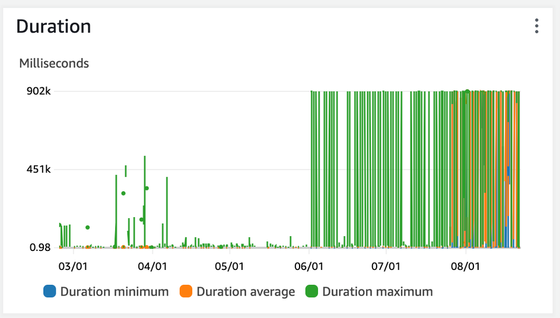
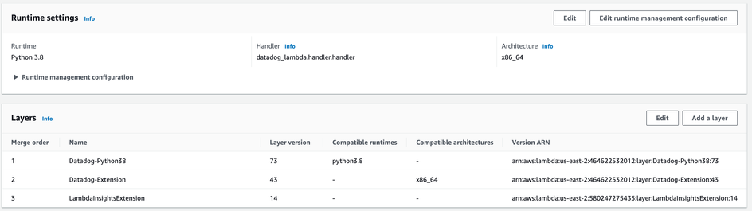
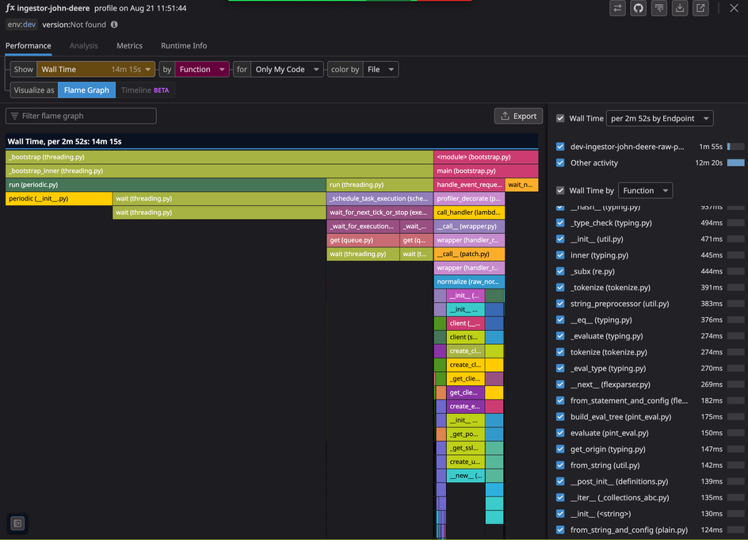
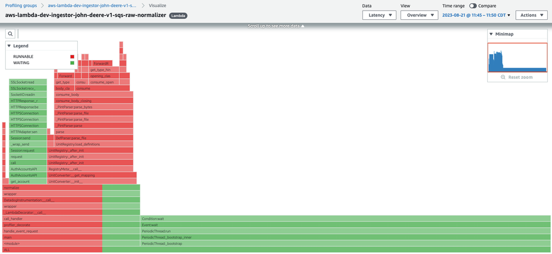
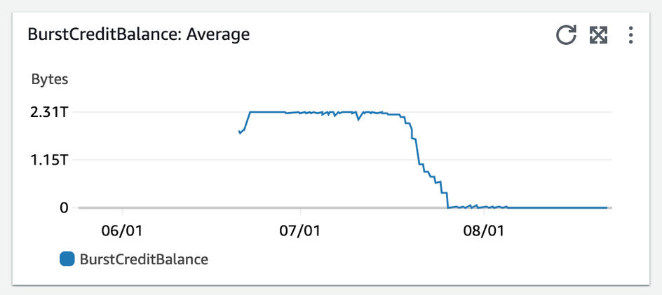
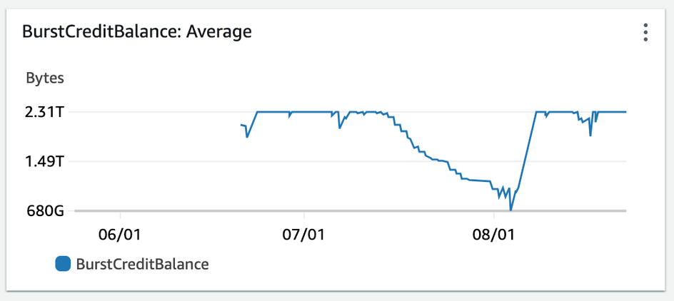
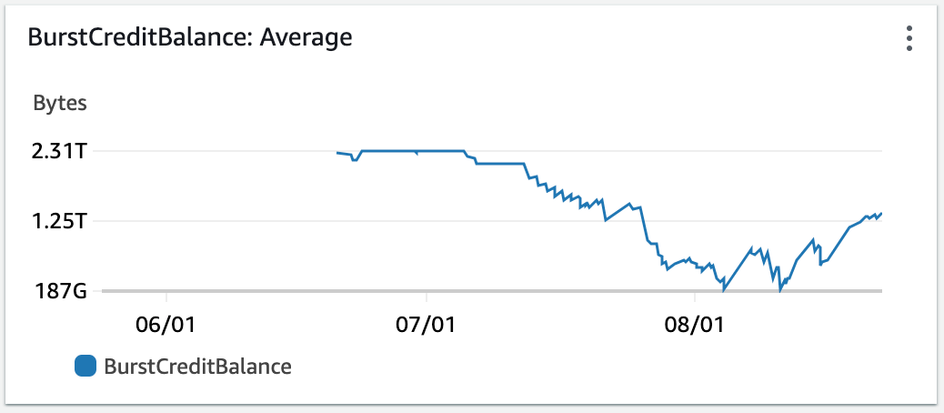
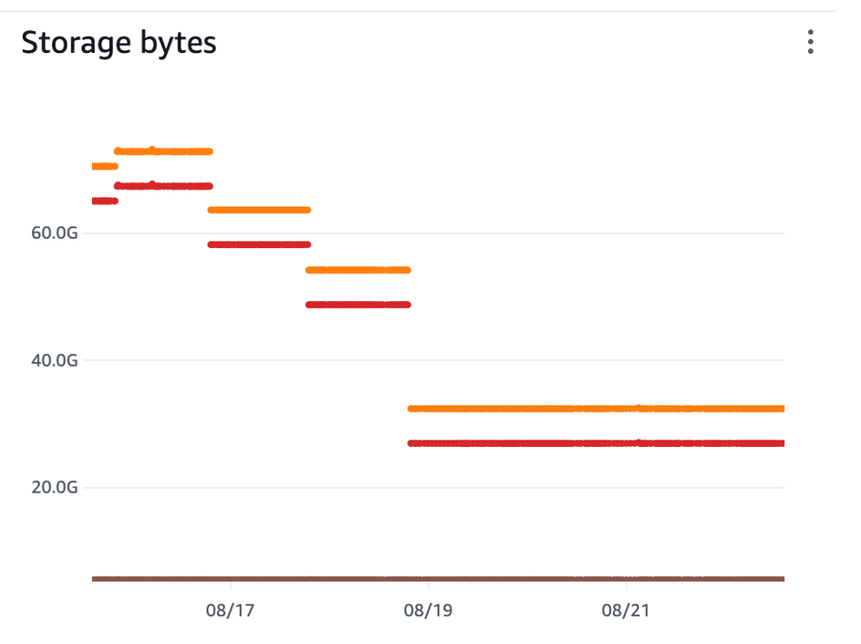
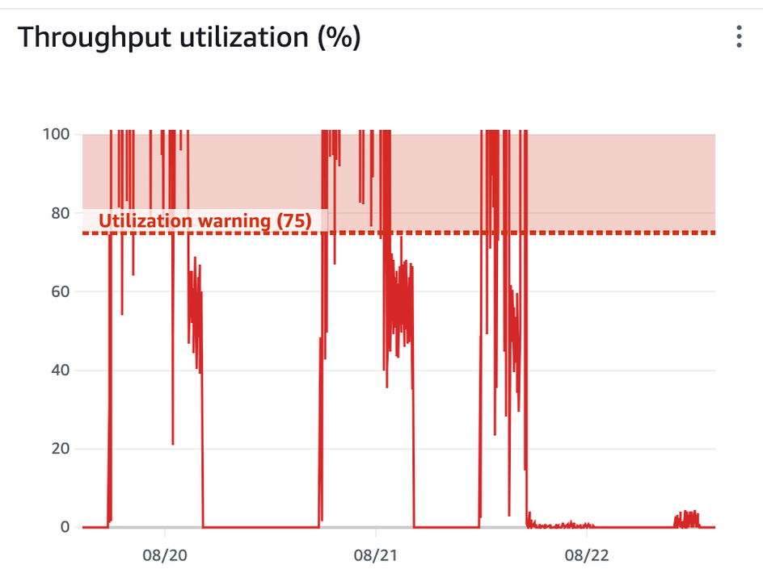
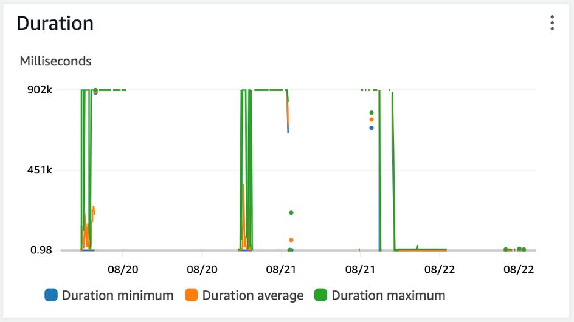

On 2023-08-21, several days after increasing dev costs were noticed, sprint Q-23.Q3.4 began and I was assigned DB-2292. This ticket was independently created a month before and asked for investigation into lambda timeouts. Because of performance improvements over the past 3 months, noticing a timeout was surprising and indicated a significantly large file. 

The specific lambda in question was the dev-ingestor-john-deere-v1-sqs-raw-normalizer lambda, and CloudWatch logs for invocations showed the following for the majority of the invocations:

```
 1 2023-08-21T16:32:28.376-05:00 INIT_START Runtime Version: python:3.8.v24 Runtime Version ARN: arn:aws:lambda:us-east-2::runtime:b5727c4a44225a29455ee5ba26761eae3ea
 2 2023-08-21T16:47:38.534-05:00 START RequestId: 5b37d170-d47c-5cc8-9c04-8c2d0e50b6de Version: $LATEST
 3 2023-08-21T16:47:40.535-05:00 2023-08-21T21:47:40.535Z 5b37d170-d47c-5cc8-9c04-8c2d0e50b6de Task timed out after 902.06 seconds
 4 2023-08-21T16:47:40.535-05:00 END RequestId: 5b37d170-d47c-5cc8-9c04-8c2d0e50b6de
 5 2023-08-21T16:47:40.535-05:00 REPORT RequestId: 5b37d170-d47c-5cc8-9c04-8c2d0e50b6de Duration: 902064.61 ms Billed Duration: 900000 ms Memory Size: 10240 MB Max Mem
```

Looking through CloudWatch metrics for this dev lambda, we see the 6-month history showing a drastic increase starting June 2nd. 



Several things are important in this context:
1. QA & UAT versions of this lambda show decreased performance and timeouts starting roughly 2 weeks later, indicating this could have been a reversion introduced as part of a release. 
2. QA & UAT environments did NOT show the significant cost increase that DEV did.

### Correlated Changes

It is difficult to track down what code was deployed to dev during this time, as developers have the ability to deploy local un-comitted code. We can however trust that QA & UAT environments followed the release schedule. This PR was around the time of the first uat-ingestor-john-deere-v1-sqs-raw-normalizer timeout: (link hidden)  (our release cycle deploys to UAT at the conclusion of each QA session, so these changes would have been live in UAT)

The only change of note is the inclusion of the DataDog Serverless Plugin, which introduces a new Lambda layer around our functions.



To understand the issue with @Berkh Tsogtbaatar, we deployed a new configuration of the Datadog Serverless plugin to enable profiling and separately manually enabled CodeGuru profiling in AWS. Respectively, these showed the following flamegraphs:





These graphs are telling: for an invocation with a CPU time of 3 minutes, the wall time was almost 15 minutes, the maximum Lambda supports before dying. Both flamegraphs showed the wall time being consumed by the Python stdlibs threading module, imported from the Datadog layer’s periodic.py file. Seeing this, we knew this was not a performance-related reversion introduced in our code. In fact, these lambda handlers were never getting invoked - all the walltime was spent in the layer wrapping of the handler. We know this because subsequent deploys with debug logging statements were never printed in subsequent runs.

Knowing this, I did not have enough information to know why this was drastically affecting a single environment. So I tried the following steps:
 1. in dev, manually down-versioned the Python 3.8 runtime:
 2. in dev, manually modify the Python version to 3.11
 3. reconfigure the Serverless Datadog Plugin
 4. remove the Serverless Datadog Plugin
 5. remove the Serverless Lambda insights plugin
 6. redeployed EFS packages

None of these modifications successfully changed the lambda to its previous behaviour. 
Assuming the same Cloudformation configurations, there are only a few things in our AWS accounts that would lead to one account behaving differently than another across multiple releases:
 1. traffic
 2. environment-specific configuration
 3. account-specific quotas

Only a few services in our environment are environment specific (literally configured differently): Elasticsearch, certain VPC security groups, and (I thought, mistakenly) EFS. Trusting that Elasticsearch 
was not the problem here, I began looking into EFS.

All Connect EFS were set to generalPurpose and burst. Burst throughput scales IO dependent on the amount of data on the file system and accrues burst “credits” over time that can be spent during more intensive IO operations: This was a concept the BE team was not familiar with, as the majority of our team (including me) inherited these services upon employement. Using Cloudwatch, we compare burst credits across our lower environments for the past 3 months we see this:

##### Dev

##### QA

##### UAT 


#### Our “burst” EFS had consumed all of its credits in Dev. 

The rate at which EFS accrues credits is dependant on the amount of storage it holds. 3 months ago, we released a lambda that removed stale files from EFS. (link hidden). This was done to prevent an accrual of data from badly managed file IO across many lambdas and teams. What wasn’t realized at the time, was that this would affect the baseline rate at which burst credits were collected. I do not have a comparably long graph of Dev EFS storage sizes, but a 3-month graph would directionally resemble this 1 week example, where each color is a storage tier: 



This much smaller Dev EFS size would explain the difference in EFS burst credits across environments, as QA and UAT are much larger than 30-40gb. 

To test the theory, I switched our EFS from “burst” to “elastic”, a more expensive, but less limited throughput setting. The below chart shows the difference in throughput - the drop is immediate:



dev-ingestor-john-deere-v1-sqs-raw-normalizer invocations resumed after this deploy. 



### Key Points
 1. As we moved to Parquet (using Geopandas & Pyarrow, which enable multithreaded reads) we traded significant IO & compute time for consuming more burst credits.
 2. Leaving old or littered data in our EFS unknowingly benefitted us, as we accrued burst credits at a faster rate.
 3. Changing our EFS from “burst” to “elastic” will remove throughput’s dependancy on storage amount, but at a significantly higher cost:

### Proposals for Mitigating Steps
At the moment EFS is a required service, as it enables us to use many important but large Python packages for computation.
###### Move Lambda IO operations to Lambda ephemeral storage 
It is untenable to write large amounts of data to EFS simply to increase our burst credit accrual rate. Instead, we should leverage Lambda ephemeral storage for our IO operations, and keep EFS only for hosting large Python packages.

###### Reduce unneeded IO operations
At least one location in our code performs unnecssary IO operations: the raw normalizer unzips the shapefile when it only needs the metadata. This can be rewritten so that the John Deere raw normalizer only unzips the metadata file. This would further reduce the cost of increasing Lambda ephemeral storage.

###### Remove uneeded events
As Connect matured, several features saw no use or importance: the normalization of the FFT for storage in the hierarchy metadata table and access via Graphql. Removing the eventing of these payloads to the raw-persister would be a single location we could comment out to prevent downstream lambdas from invoking, and thus be another way to reduce cost, and limit the breadth of knowledge Connect BE engineers be required to know.